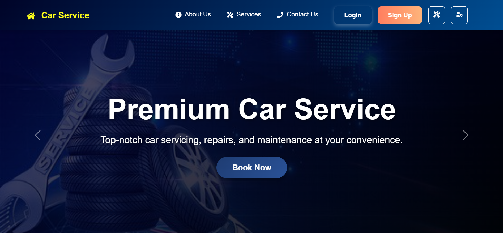
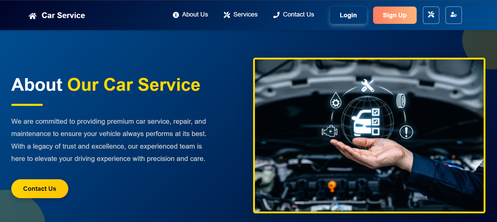
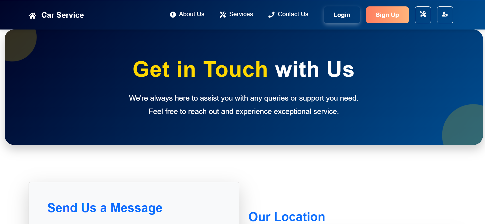
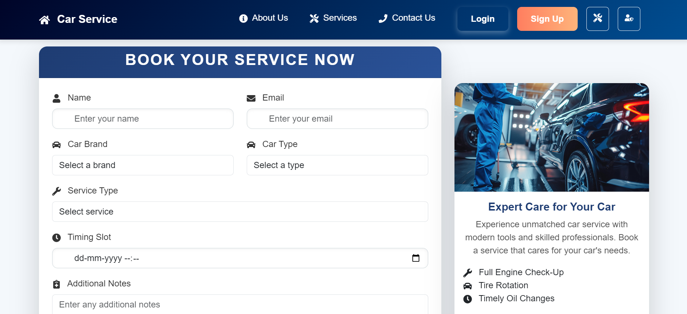
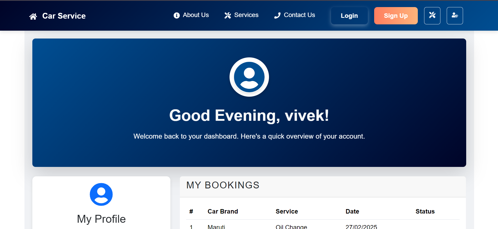

🚗 Car Service

      

An advanced full-stack car service website built using the MERN stack. This project includes modern and essential features such as:

✅ User Authentication (Signup/Login)

📅 Booking car services with scheduling

📊 Personalized user dashboard

📄 Detailed service history tracking

🎨 Responsive UI with Bootstrap

This project demonstrates the power of combining MongoDB, Express, React, and Node.js to build a fully functional, scalable, and visually appealing service platform.
## 🚗 Car Service Website Screenshots

### 🔍 Homepage Preview

---

### ℹ️ About Us Page

---

### 📞 Contact Us Page

---

### 📅 Booking Page

---

### 🧑‍💼 User Dashboard

