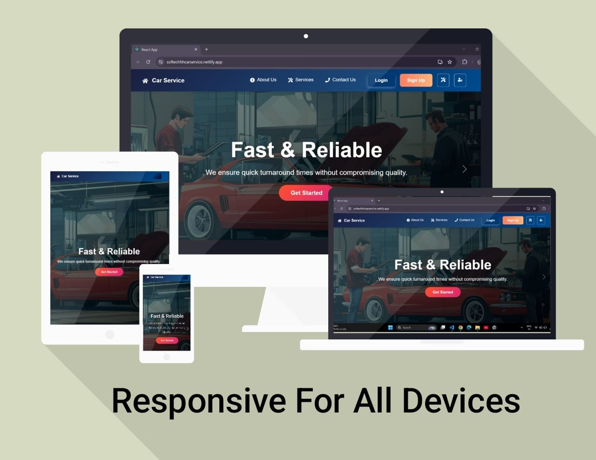

# 🚗 GetCarService

GetCarService is a full-stack MERN (MongoDB, Express, React, Node.js) web application that allows users to book car services online. Admins can manage services and bookings, while users can browse, book, and view their service history.

##  Responsive UI
 

## 🔗 Live Demo

**Deployed at:** [https://softechhhcarservice.netlify.app/](https://softechhhcarservice.netlify.app/)  

---

## 🛠️ Tech Stack

- **Frontend:** React, React-Bootstrap, CSS
- **Backend:** Node.js, Express.js
- **Database:** MongoDB
- **Authentication:** JWT & bcrypt
- **Deployment:** Netlify (Frontend), Render / Vercel / Railway (Backend)

---

## 📦 Features

- 🚘 Browse available car services
- 🔐 User authentication (Sign Up / Login)
- 📅 Book car services with preferred brand and model
- 👤 User Dashboard to manage profile and view bookings
- 🧑‍💼 Admin panel to manage car services and bookings

---

## 🚀 Getting Started

### Prerequisites

- Node.js (v14 or later)
- MongoDB (local or Atlas)
- npm or yarn

## 🚗 Car Service Website Screenshots

### 🔍 Homepage Preview


---

### ℹ About Us Page


---

### 📞 Contact Us Page


---

### 📅 Booking Page


---

### 🧑‍💼 User Dashboard


### Installation

Clone the repo and install dependencies:

```bash
git clone https://github.com/tarunaaaa/GetCarService.git
cd GetCarService
npm install

